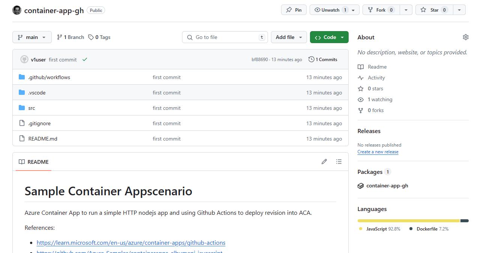
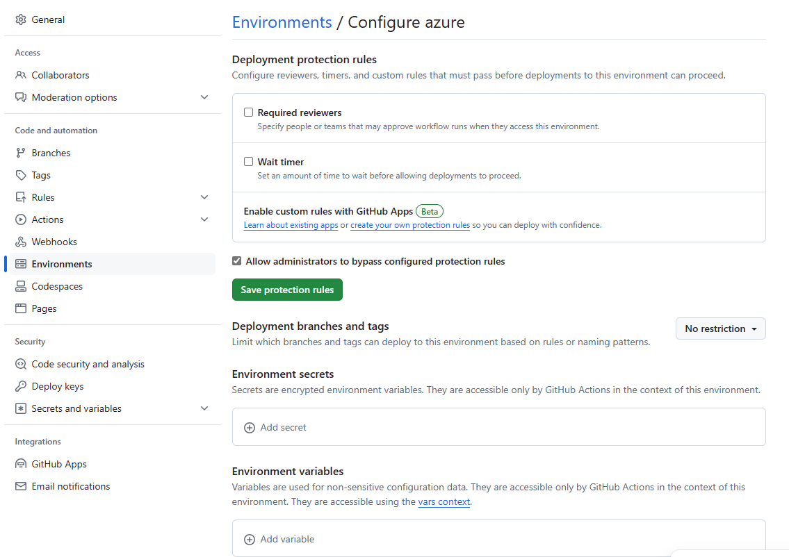
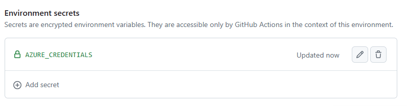
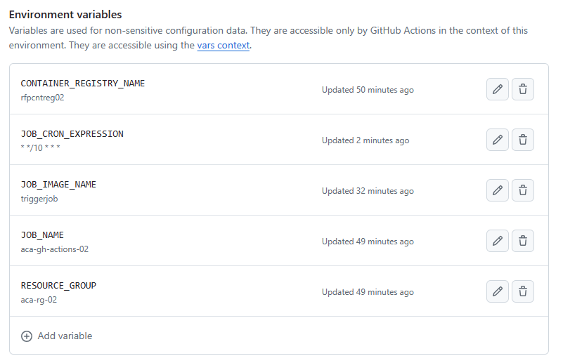

# Container Apps Jobs

References:
- https://github.com/Azure-Samples/container-apps-jobs


## Run and test it locally

Using npm:

```bash	
cd src
URL="https://reqres.in/api/users?page=2"
npm run start
```

Or using Docker:

```bash
cd src
docker build -t myjob .
docker run -e URL="https://stackoverflow.com" myjob
```

## Prepare it first for GitHub Actions

Before you will be able to run GitHub Actions to deploy Container Apps, you need to have the following:
- A GitHub repository with the source code of your app
- An Azure service principal and the credentials for authentication with Azure. It will be used by GitHub Actions to deploy the Container Apps
- A secret in the GitHub repository to store the Azure service principal credentials
- An Azure Resource Group where to deploy Container Apps
- An Azure Container Registry to store the container images of the Container Apps

**Create Azure infra resources**

The following script creates a new Service Principal, a new Resource Group and a Container Registry for container images. The new Resource Group will be used to deploy the Container Registry resource as well as the Container Apps.

You can edit the variables inside the script to customize the names of the resources being created.

```bash
cd scripts
az login
./initial-setup.sh
```

This command will output a file `auth.json` with the service principal credentials that will be used later for the Github Secrets.

**Create the GitHub repository**

Example:



**Create environment secrets and variables used by GitHub Actions**

In the GitHub repository, go to "Settings > Code and automation > Environments" and create a new environment with the name `azure`.



Under this environment, add a new secret with the name `AZURE_CREDENTIALS` and the content of the `auth.json` file.



And create the following variables:

- *RESOURCE_GROUP*: the resource group name where the container app will be deployed (e.g., aca-rg-02)
- *LOCATION*: the Azure region where the resources will be deployed (e.g., westeurope)
- *CONTAINER_REGISTRY_NAME*: the name of the Azure Container registry to be created/used to store container images (.e.g., rfpacr02)
- *JOB_NAME*: the name of the container app job to be deployed (e.g., aca-gh-actions-02)
- *JOB_IMAGE_NAME*: the name of the container image to build and push (e.g., triggerjob)

Example:



**Commit and push everything...***

Finally, commit and push everything to the new repository. Push will trigger 1 action:
- `build-and-deploy.yaml` that will deploy a new Container App Job to Azure
